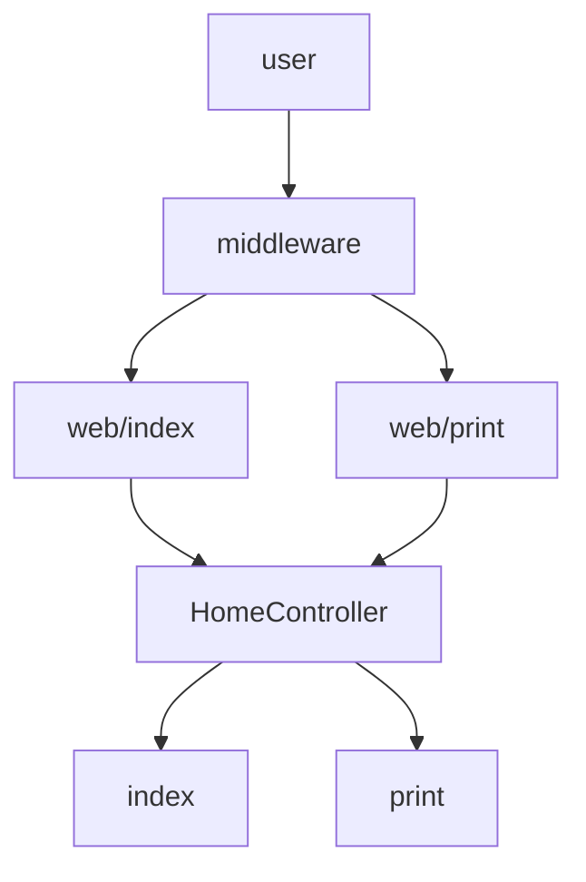

# 如何設定路由

1. 製造controller

- 位置：專案終端機
- 會有設定好的常用內容

```Linux
php artisan make:controller [Controller Name] --resource
```

- 沒有設定好的內容

```Linux
php artisan make:controller [Controller Name]
```

2. 設定路由

- 位置：laravel/routes/web.php

```php
// 用post打這個網址時，觸發這個Controller
Route::post('/','ProductController@create');

// CRUD 的網址可以用以下產生
// 針對product產生網址
Route::resource('products', 'ProductController');
```

3. 增加nampespace

- 位置：laravel/app/ProvidersRouteServiceProvider.php

```php
    public const HOME = '/home';
    protected $namespace = 'App\Http\Controllers'; 
```

<hr>

## group prefix

- 這堆路由都過middleware
- 自動加上前綴詞
  - web/index
  - web/print
- 走同一個namespace


```php
Route::group(
  [
    'middleware' => ['checkValidIp'],
    'prefix' => 'web',
    'namespace' => 'Web'
  ],function()
  {
    Route::get('/index','HomeController@index');
    Route::post('/print', 'HomeController@print');
  });
```


